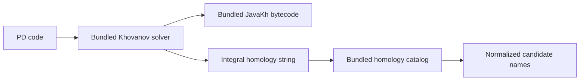

# khovanov-indexer

Identify catalogued knots from a planar diagram (PD) code by computing integral
Khovanov homology with the bundled JavaKh backend and looking up all matching
names.

Khovanov homology is not used here as a claim of unique identification. A
result can contain multiple catalog names, and an empty result means that the
computed string is absent from this repository's catalog.

## Requirements

- Python 3.10 or newer
- A Java runtime (`java` on `PATH`, or pass an explicit path)

The unknot fast path does not start Java. This repository is independently
cloneable: all organization dependencies and JavaKh bytecode are regular
tracked files, not Git submodules. Bash and symbolic links are not required.

## Command-line usage

```bash
echo '[[1, 5, 2, 4], [3, 1, 4, 6], [5, 3, 6, 2]]' | python src/main.py
```

Each candidate name is printed on its own line. Backend controls:

```bash
python src/main.py --java /path/to/java --timeout 120 --max-heap 4g
```

Invalid input and backend failures produce a diagnostic and exit status 2.
Input is parsed with `ast.literal_eval`, never `eval`.

## Python API

```python
from khovanov_indexer import khovanov_indexer

candidates = khovanov_indexer(
    pd_code, java_path="java", timeout=120, max_heap="4g"
)
```

## Pipeline


```mermaid
flowchart LR
    A["PD code"] --> B["Bundled Khovanov solver"]
    B --> C["Bundled JavaKh bytecode"]
    B --> D["Integral homology string"]
    D --> E["Bundled homology catalog"]
    E --> F["Normalized candidate names"]
```

The solver safely validates the PD code, removes Reidemeister-I and verified
nugatory crossings, and handles the unknot explicitly. Other diagrams are
written to an isolated temporary `PD.txt`; JavaKh is started directly with a
platform-correct classpath. Exit status and output syntax are checked.

The 1,871-line catalog is parsed and normalized once per process. The bundled
solver is invoked as a local program using a fixed tracked path; no code
modifies `sys.path` or invokes Git submodule commands. See
`VENDORED_DEPENDENCIES.md` for audited revisions.

## Development

```bash
python -m unittest discover -s tests -v
```

Tests include an end-to-end trefoil computation when Java is available. No
PyPI publication is performed as part of repository maintenance.
