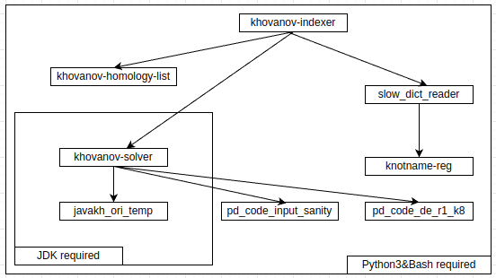

# khovanov-indexer
根据 khovanov 同调，将 pd_code 转换为扭结的名称。

## 前置条件

- `python3`
- `openjdk-11`

## 运行方式

- `python3 ./src/main.py`
  - 向标准输入流填入一个 list of list 作为 PD_CODE
  - 程序会将所有检索到的扭结名称输出到标准输出，每行包含一个扭结名称

## 依赖关系图

